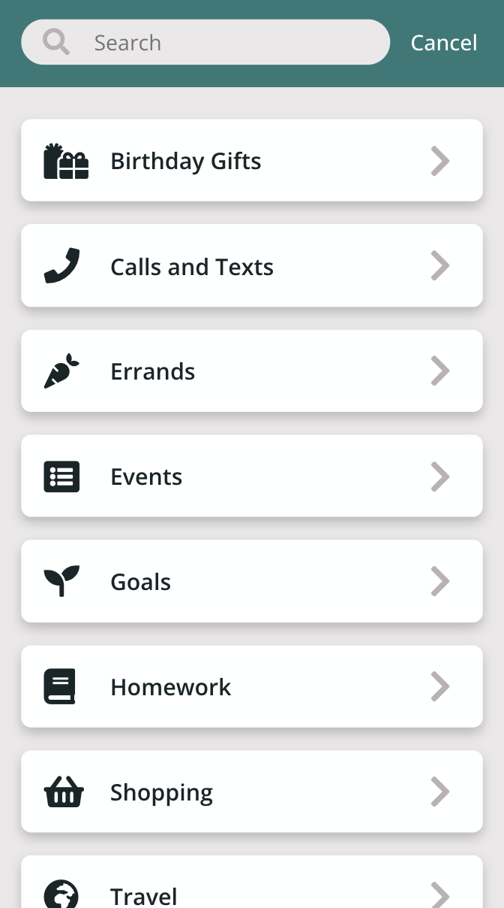
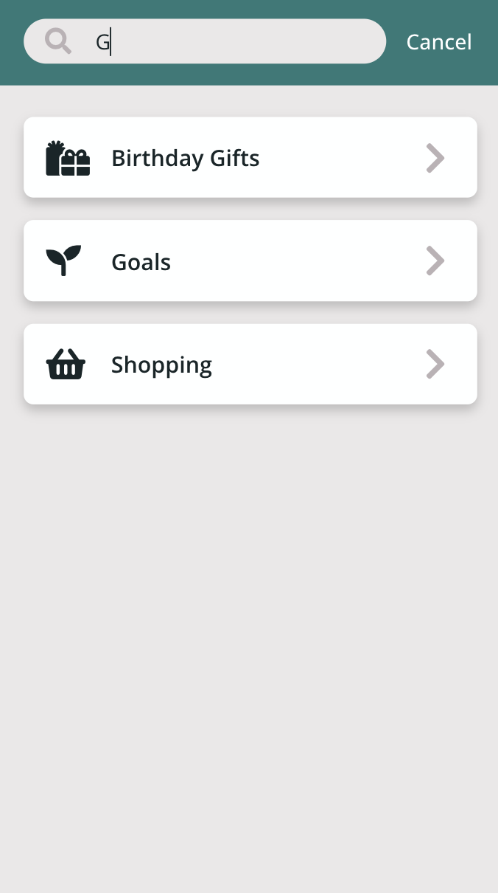

# CS 124 Lab 1 Design Document

## Final App: Home Page

As our app currently stands, this is how the home page for an existing user would look. We decided to give users the ability to create multiple lists, since users might want to sort tasks into separate lists based on what category of tasks they belong to (for example, Homework versus Shopping).

The circular plus icon in the bottom right corner allows users to create a new list of tasks. We decided it wasn't necessary for the plus icon to be accompanied by any instructive text because during usability testing, participants didn't have trouble comprehending the purpose of a plus icon without text, as we explain further in the usability testing section below.

In order to save space, we decided not to display the search bar in a fixed position just under the top navigation bar. Instead, upon being tapped, the magnifying glass icon in the top right corner expands to a search bar that fills the entire top navigation bar. This happens in apps such as Facebook, Twitter, and Instagram, so we thought that users would be accustomed to such behavior. Search results will contain lists whose names match the search, and also tasks whose descriptions match the search. During usability testing, this two-layer searching ability was something users requested. In our current design, two-layer searching is not included (users can only see names of lists); however, we plan to include this in future iterations of our app.

Tapping on the gear icon in the top right will bring users to their user setting page, where they can edit their name, email, etc. That page will be implemented when we introduce user authentication to our app.

Users should tap a card for an individual list in order to get to the Single List Page, which will display all the tasks for that list.

Users should swipe from right to left on the cards for individual lists in order to reveal the pencil icon and the trash can icon for editing the list and deleting the list, respectively. We believed this swiping motion would be intuitive because it was something users are already accustomed to from their interactions with other mobile apps, and that hypothesis was confirmed by our user testing.

## Final App: Create List Page / Edit List Page

When a user taps the plus button on the Home Page, they will be brought to the Create List Page, where they can enter a list name into the input box in the top navigation bar, and also select an icon to represent their list. We wanted to give users a way to customize the appearances of their lists to their liking. The X icon cancels the action of creating a new list, while the checkmark icon saves the newly created list. This is similar to behavior seen in apps such as Google Calendar, when users edit Calendar Events on mobile devices. The checkmark icon is only enabled after the user has named their list and given it a representative icon.

## Final App: Single List Page

When a user taps the card for an individual list on the Home Page, the user will be brought to the Single List Page, which displays all the tasks in that list, sorted in chronological order, as well as a search bar for filtering through the tasks in that list. We thought it would be helpful to have the option to attach dates to tasks in case users want to perform specific tasks at specific times / dates. We also thought the search functionality would be helpful in case there are many tasks in a single list.

The circular plus icon in the bottom right corner of the Single List Page serves a similar purpose to the plus icon on the Home Page. But instead of creating a new list, the plus icon now enables users to add a new task.

Users can tap the 3 horizontal dots in the top right corner of the Single List Page to enter the Single List Page's Menu Mode, where they can customize the list appearance by going to the Edit List Page (which is basically the same as the Create List Page), hide / show completed tasks, delete completed tasks, delete all tasks, or delete the list.

Initially, we had the delete options appear directly on the Single List Page; they were not hidden in this menu mode. However, during usability testing, participants remarked that having the "Add New Task" and "Delete All Tasks" buttons so close to each other would lead to unwanted accidental deletes. That's why we decided to add this extra layer of tapping the 3 dots to enter the Single List Page Menu Mode.

Similarly, we initially had our "Hide completed tasks" filter appear directly on the Single List Page. However, that took up a lot of space, so we decided to put it in this menu so that we could display more tasks onscreen.

## Final App: View Task Page

When a user taps the card for a task on the Single List Page, they are brought to the View Task Page, where they can view more details about that task, such as location and additional notes, which aren't visible on the Single List Page of all tasks.

Users can tap the X icon to return to the Single List Page of all tasks in the list. Or, alternatively, they can tap the pencil icon to go to the Edit Task Page. This was inspired by Google Calendar, which has a similar mobile user flow. The two-step user flow prevents users from accidentally editing a task when all they want to do is just to view that task.

## Final App: Edit Task Page

When a user taps the pencil icon on the View Task Page, they are brought to the Edit Task Page, where they can edit the task name in the input box at the top of the page. They can also change the task date and time using dropdown menus, as well as set the location of the task, add any additional notes, and/or mark the task as completed / not completed. Clicking the trash can icon at the bottom of the Edit Task Page will delete the task.

## Alternate Designs: Home Page and Single List Page Initial Brainstorming

The drawing on the left shows our initial Single List Page design, and the drawing on the right is our initial Home Page design.

We originally wanted each Home Page list to have horizontal griplines that users could use to reorder the lists. However, we later decided that icons as visual representations of the lists were more of a priority. So, our current app does not have the gripline feature. We may provide users with the ability to reorder lists in the future.

Also, we original planned to use 3 dots on each list card to reveal more options for editing each list. However, we later decided that having a right arrow icon would be more intuitive to users (since the arrow would indicate that they should swipe to reveal more options).

We initially placed the "create new list" plus button in the top navigation bar of our home page, but later decided that it would be more intuitive to add a new list after all existing lists, so we ended up placing the plus button in the bottom right corner of our app.

For the Single List Page, we originally wanted to give users sort and filter functionality directly on the page, instead of in a menu mode version of the page. However, we later discovered that sort and filter would take up too much space and prevent users from seeing a maximal number of tasks at once. So, we decided not to implement sorting (at least temporarily), and to hide the filter by completion status functionality in the Single List Page's menu mode.

Also, we originally intended to locate the "delete completed tasks" / "delete all tasks" buttons directly on the Single List Page, but received feedback from user testing that users were scared of accidentally hitting the delete button while scrolling to see more tasks. So, we decided to hide the delete functionality in the Single List Page's menu mode as well.

## Alternate Designs: Home Page

This is the first version of our Home Page that we coded up. It uses the font Karla instead of Open Sans. We decided to use Open Sans instead because it is a cleaner font that would be easier to read.

This version of our app also uses a different color palette. After listening to Dr. Milburn's presentation on design, we decided to revise our color palette to better reflect the energy and connotations that we wanted our app to have.

This Home Page also has two plus buttons: one plus button in the top right corner, and one at the bottom. They serve the same functionality, which Prof. Rhodes found to be confusing. So, we decided to just consolidate the two buttons into a single button in the final version of our app for Lab 1.

This is the second version of our Home Page that we created. As mentioned above, we decided to house the search bar within the top navigation bar to save space. And we also decided to de-prioritize the griplines for reordering the lists. User testing told us that it was not necessary to spell out the functionality of the plus button, so we removed the "Create New List" text in the final version of our Home Page for Lab 1.

## Alternate Designs: Single List Page

This is the first version of our Single List Page that we created. As mentioned above, we later decided to save space by putting the hide completed tasks behind a Single List Page menu mode, and to reduce the chances of users accidentally deleting all tasks by placing that functionality in the menu mode as well. We'll discuss this in more detail in the usability testing section below.

In our final Single List Page, we decided to decrease the font weight to give our app a more sleek feel. We also decided to place the back button on the left side of the top navigation bar, since that is a more intuitive position for a back button, in addition to replacing the home icon with a left arrow back button more evocative of the right arrow button that users would see on the Home Page.

## Usability Testing

We conducted usability testing with four Mudd friends, asking them to tell us about their impressions of our app and how they would navigate from page to page to perform certain tasks.

## Usability Testing: Home Page

Without any prompting, usability testing participants were able to understand that tapping the plus button would create a new list. That told us that there was no need to include text like explaining the plus icon, which we had previously believed would be necessary. So, the final version of our app does not contain text accompanying the plus icon.

## Usability Testing: Home Page New Version

Users understood that if they tapped an individual list, they would see more of the list (i.e., tasks contained in the list). That told us that we had a user-friendly structure with a Home Page containing multiple lists, and then Single List Pages that could be accessed by tapping lists on the Home Page.

Users understood that swiping from right to left would reveal the pencil and trashcan icons. They mentioned that other apps used that same swiping motion. They also understood that the pencil icon would allow them to edit an individual list, while the trashcan icon would delete the list. So, we decided to keep these features in our final version of the Home Page for Lab 1.

## Usability Testing: Home Page Search

Originally, our app displayed an empty screen before users entered search keywords. However, usability testing participants told us that they wanted to see all the list items displayed on the screen, if they had not yet typed anything in the search bar, so that the search would behave like it filtered. That's why we decided to change our app so that the search starts with all lists displayed, and then gradually filters those lists as the user types their search terms.

## Usability Testing: Single List Page

Usability testing participants knew the home icon would bring them back to the Home Page, but preferred having a back icon more reflective of the arrow icon they saw on the Home Page. So, we decided to change the home icon into a left arrow icon in the final version of our Single List Page for Lab 1.

Furthermore, users did not like that the Add New Task and Delete All Tasks buttons were situated right next to each other in this first version of our Single List Page, saying that it would be easy to make a mistake and delete all tasks, when they were actually intending to add a new task. To prevent such accidents, we decided to hide the delete all tasks functionality behind a separate menu mode that users could only enter upon tapping the 3 dots in the top right corner of the Single List page.

## Usability Testing: Edit Task Page

While users understood that this page would allow them to edit a task name, date, location, notes, and completion status, they didn't see a way to get out of this page without deleting the task they were trying to edit. That was an oversight on our part. In our final design of the Edit Task Page for Lab 1, we decided to add an X icon to the top left corner and a checkmark to the top right corner of this page to allow users to get back to the Single List Page without saving their changes, or with saving their changes, respectively.

## Challenges

challenges you faced

## Wins

parts of the design you're most proud of
