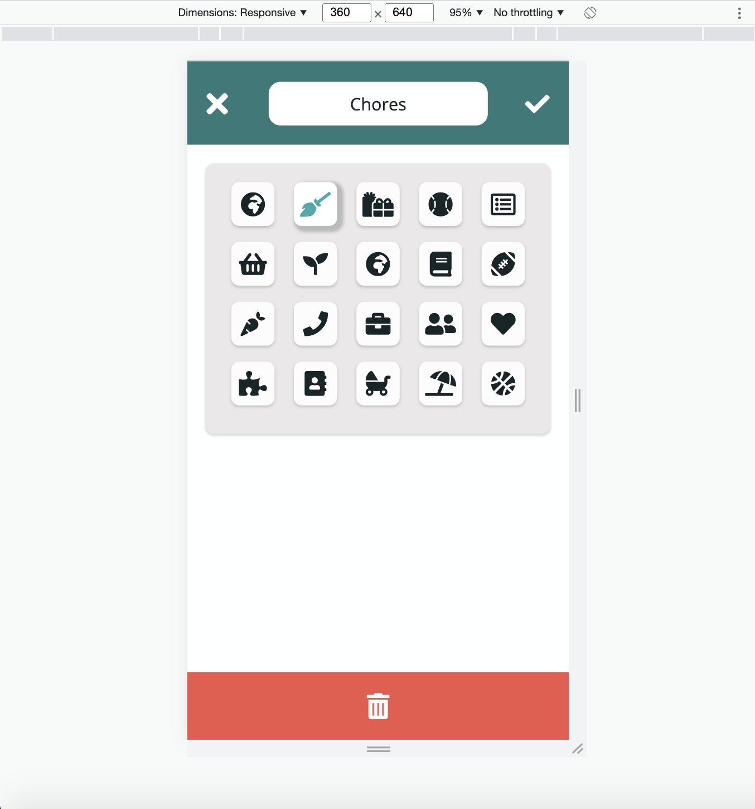

# CS 124 Lab 1 Design Document

## Final App

your design decisions, including their rationale (include images)

### Home Page

#### Home Page Search

#### Home Page Edit Task Mode

### Create List Page

### Single List Page

### View Task Page

### Edit Task Page

#### Edit Task Page Menu Mode

## Alternate Designs Considered

alternative designs you considered, including images

### Home Page

Uses Karla instead of Open Sans. Uses a different color palette.

## Usability Testing

any user testing you did

## Challenges

challenges you faced

## Wins

parts of the design you're most proud of
