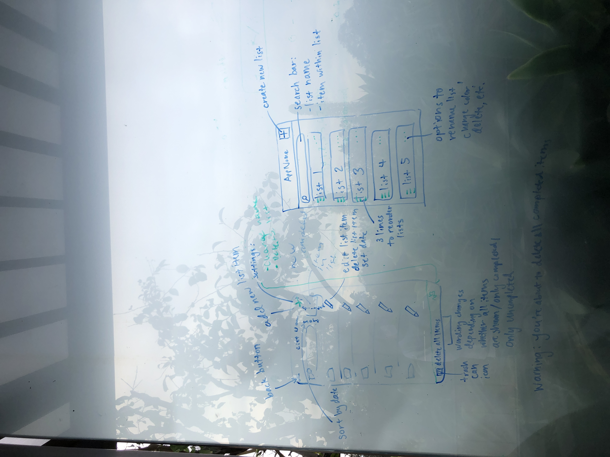
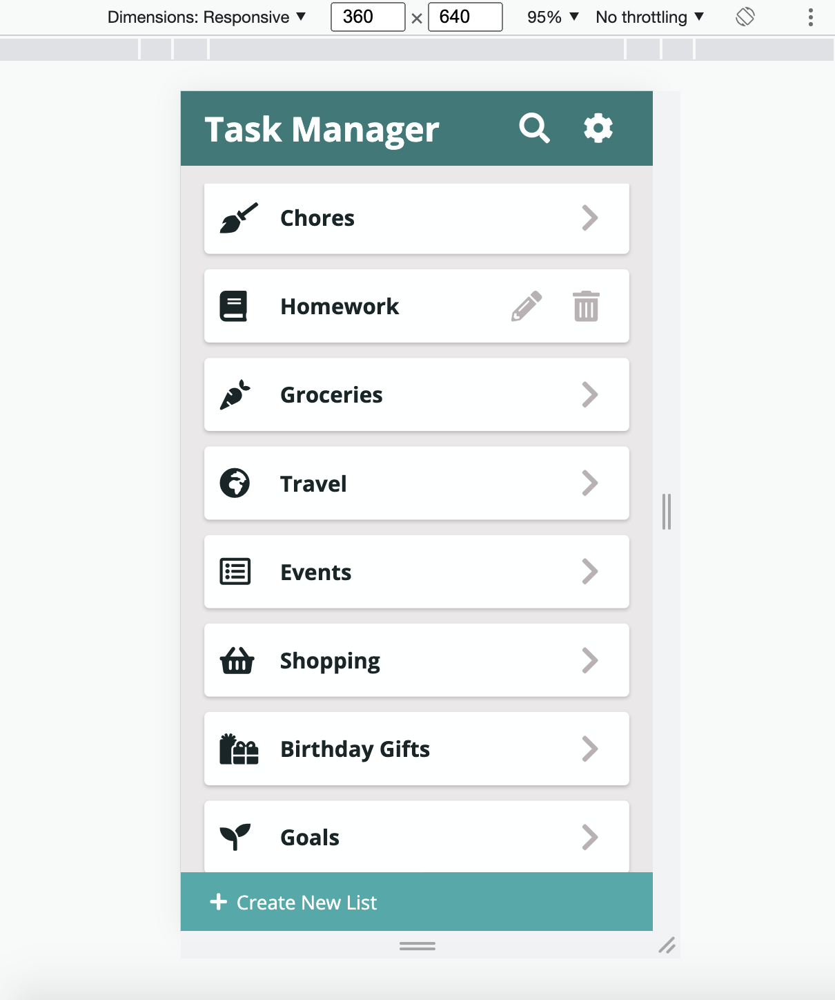
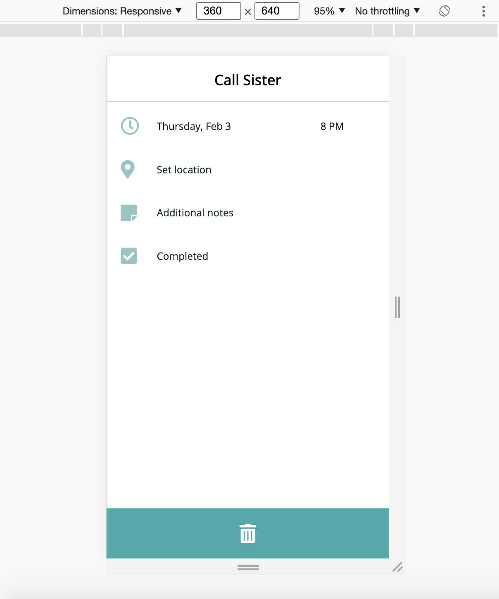

# CS 124 Lab 1 Design Document

## Final App: Home Page

your design decisions, including their rationale (include images)

## Final App: Create List Page

## Final App: Single List Page

## Final App: View Task Page

## Final App: Edit Task Page

## Alternate Designs: Home Page and Single List Page Initial Brainstorming

## Alternate Designs: Home Page

alternative designs you considered, including images

Uses Karla instead of Open Sans. Uses a different color palette.

## Alternate Designs: Single List Page

## Usability Testing

any user testing you did

## Usability Testing: Home Page

Users understood that the plus icon was for creating a new list; no need for text explaining the plus icon

## Usability Testing: Home Page New Version

Users didn't think the "Create New List" text was necessary; they understood it from the plus icon before.

They understood that if you tap an individual list, you should see more of the list (i.e., tasks contained in the list).

They understood the swiping thing would reveal the edit and trash icons. Mentioned other apps use swiping.

They understood the pencil icon would bring them to a page to edit the list.

They understood the trash icon would delete the list.

## Usability Testing: Home Page Search

Users want to see all the list items before searching so it's like the search filters.

## Usability Testing: Single List Page

Users knew what the home icon meant, but preferred a back icon more reflective of the arrow icon that took them from the Home Page to this Single List Page.

Users didn't like that the Add New Task and Delete Tasks buttons were right next to each other -> easy to make a mistake.

## Usability Testing: Edit Task Page

Users didn't see a way to get out of this page without deleting the task they were trying to edit. So we decided to add an X icon and a checkmark to do BLANK to get back to the Single List Page

## Challenges

challenges you faced

## Wins

parts of the design you're most proud of
